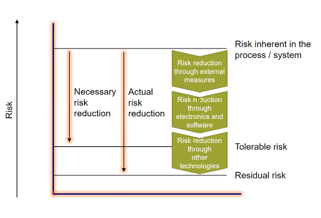
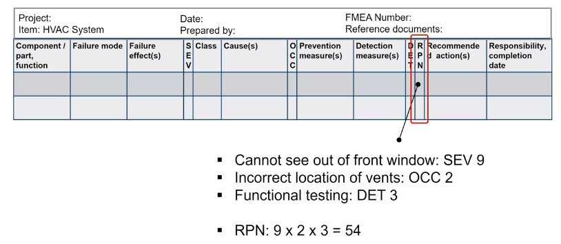

 - [Safety](#safety)
  - [Safety thresholds](#safety-thresholds)
  - [Risk & Risk Figures](#risk--risk-figures)
  - [Risk Perception](#risk-perception)
  - [Risk Aversion](#risk-aversion)
  - [Scale Aversion](#scale-aversion)
  - [ALARP Principle](#alarp-principle)
  - [Risk Reduction](#risk-reduction)
    - [Risk Reduction Example](#risk-reduction-example)
  - [Risk Management](#risk-management)
  - [Importance of Safety](#importance-of-safety)
  - [Hazard](#hazard)
  - [Faults, errors and failures](#faults-errors-and-failures)
    - [How systems fail ?](#how-systems-fail-)
    - [Examples](#examples)
  - [Random vs systematic issues](#random-vs-systematic-issues)
    - [Example of Random & Systematic issues](#example-of-random--systematic-issues)
  - [Random vs systematic failure](#random-vs-systematic-failure)
    - [Example : Engine Control Unit (Component Level)](#example--engine-control-unit-component-level)
  - [Safety basisc (Risk Reduction)](#safety-basisc-risk-reduction)
  - [Functional safety](#functional-safety)
    - [Lifecycle approach](#lifecycle-approach)
- [Safety](#safety)
  - [Safety thresholds](#safety-thresholds)
  - [Risk & Risk Figures](#risk--risk-figures)
  - [Risk Perception](#risk-perception)
  - [Risk Aversion](#risk-aversion)
  - [Scale Aversion](#scale-aversion)
  - [ALARP Principle](#alarp-principle)
  - [Risk Reduction](#risk-reduction)
    - [Risk Reduction Example](#risk-reduction-example)
  - [Risk Management](#risk-management)
  - [Importance of Safety](#importance-of-safety)
  - [Hazard](#hazard)
  - [Faults, errors and failures](#faults-errors-and-failures)
    - [How systems fail ?](#how-systems-fail-)
    - [Examples](#examples)
  - [Random vs systematic issues](#random-vs-systematic-issues)
    - [Example of Random & Systematic issues](#example-of-random--systematic-issues)
  - [Random vs systematic failure](#random-vs-systematic-failure)
    - [Example : Engine Control Unit (Component Level)](#example--engine-control-unit-component-level)
  - [Safety basisc (Risk Reduction)](#safety-basisc-risk-reduction)
  - [Functional safety](#functional-safety)
    - [Lifecycle approach](#lifecycle-approach)
- [Goals, requirements, specifications](#goals-requirements-specifications)
- [Safety analyses using FMEA and FTA](#safety-analyses-using-fmea-and-fta)
  - [Safety analysis](#safety-analysis)
    - [Objectives](#objectives)
    - [General scope](#general-scope)
    - [Safety analyses in the automotive safety lifecycle](#safety-analyses-in-the-automotive-safety-lifecycle)
    - [Inductive analysis methods - Failure Mode and Effects Analysis (FMEA)](#inductive-analysis-methods---failure-mode-and-effects-analysis-fmea)
      - [Example to FMEA](#example-to-fmea)
    - [Deductive analysis methods - Fault Tree Analysis(FTA)](#deductive-analysis-methods---fault-tree-analysisfta)
    - [Design FMEA - HVAC system](#design-fmea---hvac-system)
    - [Severity, Occurence, Detection, RPN](#severity-occurence-detection-rpn)
    - [Heating, Ventilation and Air Confition (HVAC) System](#heating-ventilation-and-air-confition-hvac-system)
  - [Main Notes](#main-notes)
- [Fault Tree Analysis](#fault-tree-analysis)
  - [Prerequisites](#prerequisites)
  - [Procedure](#procedure)
    - [Example](#example)
  - [Equivalent fault trees](#equivalent-fault-trees)
    - [Discussion](#discussion)
- [Definitions](#definitions)

# Safety

- Freedom form / absence of unacceptable / unreasonable risk

## Safety thresholds 

-	Concept of safety thresholds: established safety engineering principle 
    - Not unique to software or electronic systems 
    - The idea that there are various thresholds above or below which a product is considered to be safe. 
    
    
    
    

-	Main goal: To determine how safe is “safe enough” without over- or under- engineering a product 

- **Harm:** Physical injury or damange to the health of people or damage to property or the environment. [IEC 61508]

- **Harm:** Physical injury or damage to the health of persons. [ISO 26262]

- **Risk:** Combination of the probability of occurrence of harm and the severity of that harm. [IEC 61508] & [ISO 26262]

## Risk & Risk Figures

## Risk Perception

- Subjuective judgment that people make about the chraracteristics and severity of a risk.

## Risk Aversion 

- Reluctance of people to accept a bargain with uncertain payoff rather than another bargain with more certain, but possibly lower expected payoff.

## Scale Aversion 

- Tendency to want greater protection where consequences are high 
    - A scale-averse person would prefer 100 deaths as the result of more frequent incidents in a 10-year period than a single event with 100 deaths in the same period.s

## ALARP Principle 

- ALARP (As Low As is Reasonably Practical)

- Defines acceptable risk and influences selection of tools for risk reduction

## Risk Reduction 

- Goal: Reduce risk to a tolerable level by combining multiple methods/means

- Goal: Reduce risk to a tolerable level by combining multiple methods/means (not to zero)

 

### Risk Reduction Example 

## Risk Management

## Importance of Safety

- **Society, customers, lawmakers, regulatory bodies**
    - Have rising expectations regarding accident prevention as well as avoidance of injuries or damage to the health of persons 
    - Demand risk reduction to a tolerable level

- **Manufacturers, suppliers, dealers / distributors**
    - Want to satisfy expectations of customers and society 
    - Fear loss of reputation caused by accidents / disasters 
    - Prefer to avoid claims for damages and law suites 

## Hazard 

- **Potential source of harm**

- A hazard is something that can cause harm, e.g electricity, chemicals, working up a ladder, noise, a keyboard, a bully at work, stress, etc

- A risk is the chance, high or low, that any hazard will actually cause somebody harm. 

## Faults, errors and failures 

### How systems fail ? 

|             | IEC6108                                                                                                                                             | ISO26262                                                                                                                                                                |
|-------------|-----------------------------------------------------------------------------------------------------------------------------------------------------|-------------------------------------------------------------------------------------------------------------------------------------------------------------------------|
| **Fault**   | Abnormal condition that may cause a reduction in, or loss of, capability of a functional unit to perform a required function.                       | Abnormal condition that can cause an element or an item to fail                                                                                                         |
| **Error**   | Discrepancy between a computed, observed or measured value or condition and the true, specified or theoretically correct value or condition         |  Same with IEC6108.  Note: An error can arise as a result of unforeseen operating conditions or due to fault within the system, subsystem or component being considered |
| **Failure** | Termination of the ability of a functional unit to provide a required function or operation of a functional unit in any way other than as required. | Termination of the ability of an element, to perform a function as required. Note incorrect specification is a source of failure.                                       |

### Examples 

- **Aviation**
    
    - Bit flips due to cosmic rays, or a fire  <---- **FAULT**
    - As a consequence, incorrectly computed altitude of an airplane <---- **ERROR**
    - As a consequence, crash of airplane <---- **FAILURE**

- **Software testing: different terminology**

    - Wrong code  <----- **FAULT**
    - Wrong state of the program (wrong w.r.t a specification) <---- **ERROR**
    - Wrong output of the program (wrong w.r.t a specification) <--- **FAILURE**

- **A fault will lead to an error**

- **Errors need not lead to failures**  because of 
    - Masking (by changce, the error is corrected)
    - Special mechanisms like redundancy

## Random vs systematic issues 

- **Random issues** ; (typically, due to physical processes such as damage or fatigue)

- **Systematic issues**; (typically due to specification or design issues or harware wear-out)

 

### Example of Random & Systematic issues 

## Random vs systematic failure 

- **Random Failure**
    - Results from hardware degradation 
    - Occurs at a random time 
    - Resulting system failure rates can be predicted with reasonable accuracy 

- **Systematic Failure**
    - Related in a deterministic way to a certain cause 
    - Can only be eliminated by a change of the design or of the manufacturing process, operational procedures, documentation, etc. 
    - Cannot be accurately predicted/statistically quantified. 
  

### Example : Engine Control Unit (Component Level)

**EMC - Electromagnetic compatibility**

-  Failures at the component level can represent faults at the system level 

 

## Safety basisc (Risk Reduction)

- **Avoidance of systematic faults** during design, production...

    - Use of techniques and procedures that aim to avoid the introduction of faults during any phase of the safety lifecycle

- **Tolerance re. systematic faults** during operation

    - Ability of a functional unit to continue to perform a required function in presence of systematic faults or errors. 

- **Tolerance re. random faults** during operation

    - Ability of a functional unit to ocntinue to perform a required function in the presence of random faults or errors

## Functional safety 

- Functional safety focuses on the hazards and risks originating from the function of an (E/E) system
    - It does not cover risks like fire or environmental pollution. 

### Lifecycle approach 

- Concept can be traced back to 1947. 
- Manufacturer takes a systems approach by designing and building safety into the entire system from initial conceptualization to decommissioning. 
- Concept applicable to safety of complex electronics and software-based systems. 

> "The primary concern of the safety life cycle is the management of hazards: their identication, evaluation, and control through analysis, design and management procedures" [N.Leveson (1995)] 

- It emphasizes: 
    - Integration of safety into the design 
    - Systematic hazard identification and analysis 
    - Addressing the entire system in addition to the subsystems and components 
    - Using protection layers for risk reduction 
    - Qualitative and quantitative approaches 

- To achieve functional safety, manufacturers construct and implement a safety lifecycle suitable for each application.

# Goals, requirements, specifications 

-  **Hazard analysis and risk assessment identify hazards that require risk reduction**
    - A safety goal is formulated for each hazardous event. 
    - An Automotive Safety Integrity Level (ASIL) is associated with each safety goal. 
- **The functional safety concept is a statement of the functionality to achieve the safety goal**
    - Stated in the functional safety requirements 
- **The technical safety concept is a statement of how this functionality is implemented in hardware or software**
    - Stated in the technical safety requirements 

- **Software safety requirements and hardware safety requirements state the specific safety requirements which will be implemented as part of software and hardware designs**

# Safety analyses using FMEA and FTA 

## Safety analysis 

### Objectives
- Examine consequences of faults and failures on functions, behavior and design of items/elements. 
- Provide information on conditions  / causes that could lead to violation of a safety goal or safety requirement. 
- Contribute to identification of new functional or non-funcitonal hazards not previously identified during the hazard analysis and risk assessment

### General scope 

- Validation of safety goals and safety concepts
- Verification of safety concepts and safety requirements
- Identification of conditions and causes, incl. faults and failures, that could lead to the violation of a safety goal or safety requirement. 
- Identififacation of additional requirements for detection of faults or failures 
- Determination of required responses (actions/measures) to detected faults or failures 
- Identification of additional requirements for verifying that the safety goals or safety requirements are compiled with, incl. safety-related vehicle testing. 
 

### Safety analyses in the automotive safety lifecycle

 

| **Qualitative analysis methods**                                                                    | vs. | **Quantitative analysis methods**                                                                                                                                                                                                                                             |
|-----------------------------------------------------------------------------------------------------|-----|-------------------------------------------------------------------------------------------------------------------------------------------------------------------------------------------------------------------------------------------------------------------------------|
| - Identify failures  - Do not predict frequency of failures                                         |     | - Complement qualitative analyses - Predict the frequency of random hardware failures  - Used to verify hardware designs     -  Against targets for evaluation of hardware architectural metrics    -  Evaulation of safety goal violations due to random hardware failures   |
| Required knowledge: - Relevant fault types / fault models                                           |     | Required knowledge: - Relevant fault types / fault models - Quantitative failure rates of the hardware elements                                                                                                                                                               |
| Examples: - Qualitative system, design, or process FMEA - Qualitative FTA - HAZOP - Qualitative ETA |     | Examples: - Quantitative FMEA - Quantitative FTA  - Quantitative ETA - Markov models  - Reliability block diagrams                                                                                                                                                            |

### Inductive analysis methods - Failure Mode and Effects Analysis (FMEA)

#### Example to FMEA

[Example document to FMEA](https://www.reliasoft.com/images/documents/xfmea_pfmea.pdf)

### Deductive analysis methods - Fault Tree Analysis(FTA)

- Inductive and deductive approaches are usually complementary 
- FTA and FMEA can be combined to provide safety analysis with the right balance of top-down and bottom-up approaches.

### Design FMEA - HVAC system
(FMEA - Fauilure Mode and Effects Analysis)

* HVAC: Heating, Ventilation and Air Condition System

### Severity, Occurence, Detection, RPN

- **Severity (SEV)**
    - Rates the severity of a potential failure effect. (scale: 1...10)

- **Occurence (OCC)**
    - Rates the likelihood that the fauilure will occur. (scale: 1...10)

- **Detection (DET)**
    - Rates the likelihood that the problem will not be detected before it reaches the end-user/customer (scale: 1...10)

- **Risk Priority Number (RPN)**
    - RPN = SEV x OCC x DET 
    - Used to prioritize concerns/actions
    (The greater the RPN value, the greater the concern)

### Heating, Ventilation and Air Confition (HVAC) System

## Main Notes 

- FMEAs are system-level analyses
- Among other things, are used for drug production processes as well
- FMEAs can help establish (software) test goals
    - Write tests that try to provoke a failure mode 
    - These test cases are "good" in that they provide evidence that a certain problem(likely) is not present; regardless of the failure that actually can be provoked.

# Fault Tree Analysis 

- **Goal: identify all conditions that lead to a system failure (top level event)**

- Developed at Bell Labs in the 1960s for missile launch control system
- DIN and IEC standards 
- Aims at finding the sources of a system failure
- Quantitative and qualitative 
- Deductive top-down method 
- Graphical representation of casual relationships
- Used in nuclear/medical/aerospace industries

## Prerequisites

- Understand how the system works e.g FMEA
- Done when design/architecture is available 
- Facilitated discussions with different group members

## Procedure 

- Plan of the system and FMEA - if existing - taken as input
- Define system under scrutiny (its boundary)
- Determine undesired event(s) (top event)
    - Failure/malfunction
- Identify event or series of events that lead to the top level event 
    - lower-level failures

- Apply recursively
    - Symbols used: AND/OR; possibly probabilities
    - Leaves: possible cause, e.g. a single component, environmental condition, or functional characteristic, or interaction of a comabination or plurality of any thereof

- Identify cut sets 
    - Sets of events that, taken together, lead to the system failure

### Example 

## Equivalent fault trees

### Discussion 

- Safety is not absolute but rather "good enough" safety !
- Basic idea is to think about what can go wrong and provide mitigations. Many real systems are (suprisingly?) safe in practice. 
- System boundaries must be defined very early. This becomes more difficult in self-adaptive settings, or on the internet of things. (solution: runtime monitoring)
- Software does not fail randomly but only systematically. This makes it very difficult to estimate fault/error/failure probabilities. (Think about recent Tesla hazard)
- FMEAs not very widespread for software. FTAs are, when recast as attack trees(information security)

- Standards put aside, how do these ideas integrate with agile development ?

# Definitions 

