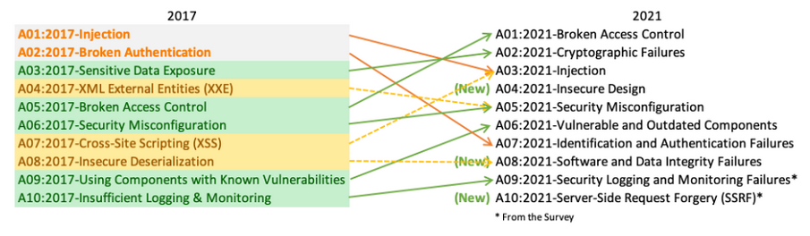
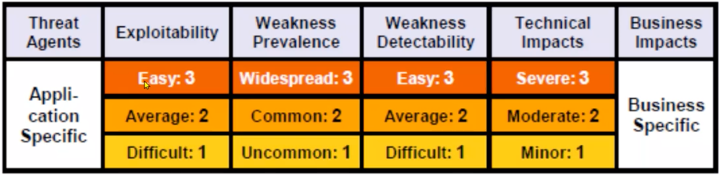
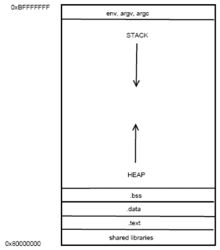
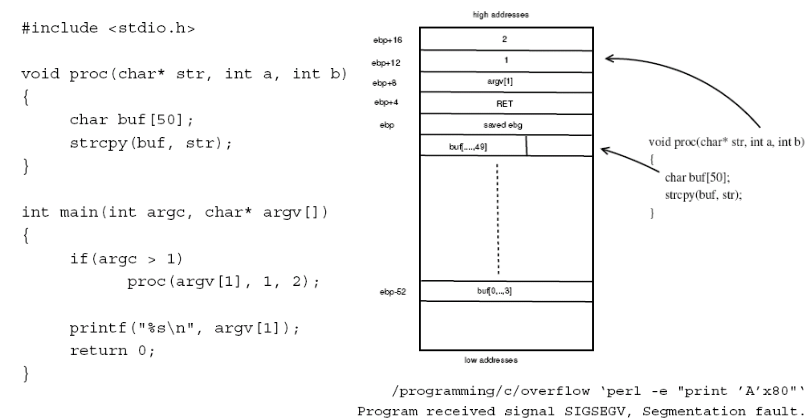
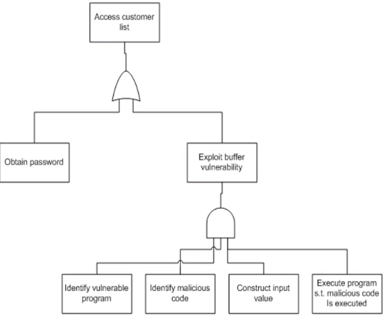
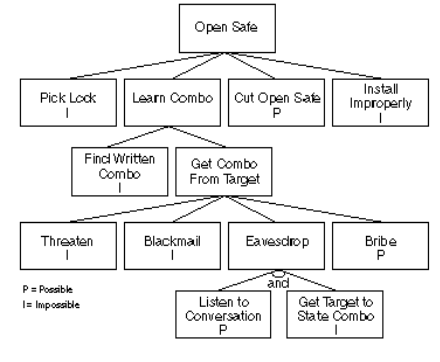
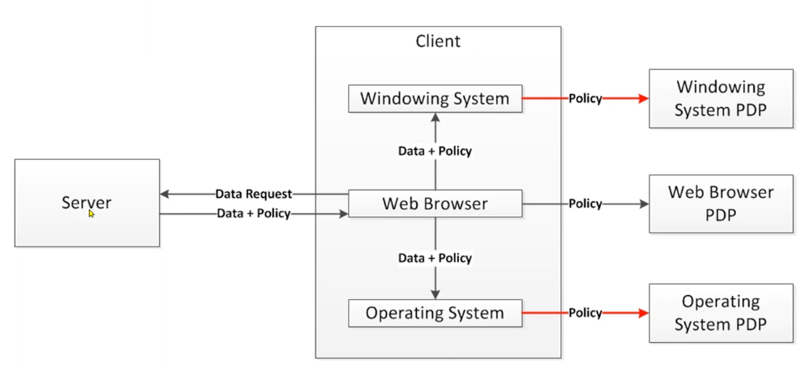
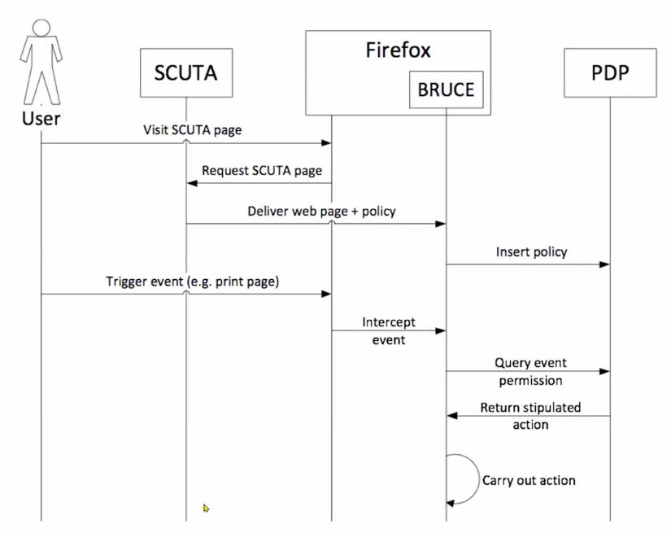
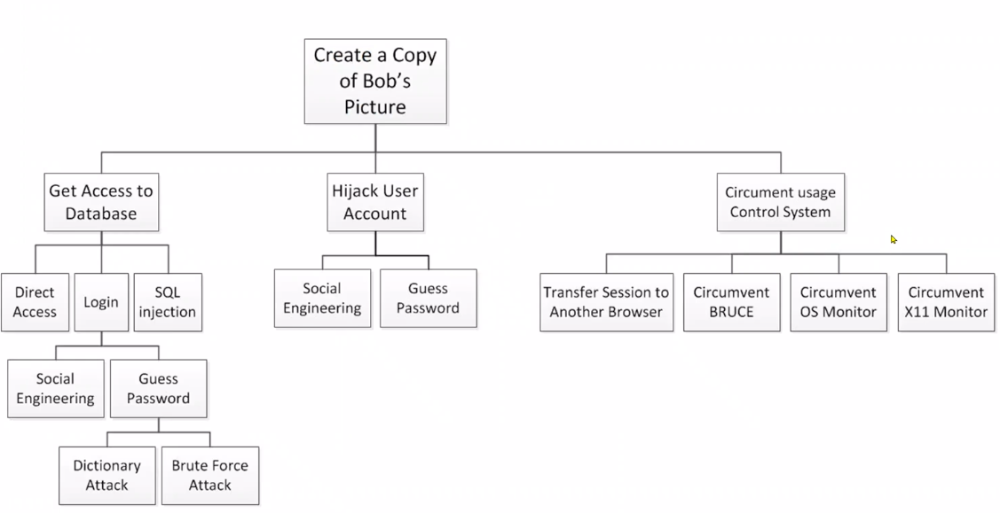
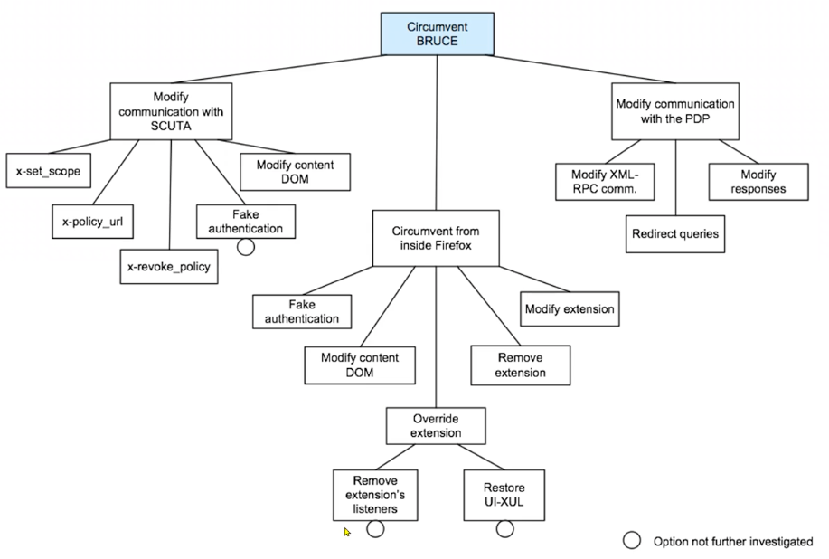

- [Information Security](#information-security)
  - [Security](#security)
  - [Security properties: CIA](#security-properties-cia)
    - [Confidentiality](#confidentiality)
    - [Integrity](#integrity)
    - [Availability](#availability)
    - [Non-repudiation](#non-repudiation)
    - [Authenticity](#authenticity)
    - [Auditability](#auditability)
    - [Accountability](#accountability)
    - [Privacy](#privacy)
    - [Anonymity](#anonymity)
  - [Critical infrastructures (A)](#critical-infrastructures-a)
    - [Private data (C,I)](#private-data-ci)
    - [Commercial data (C,I)](#commercial-data-ci)
    - [Government data (C,I,A)](#government-data-cia)
  - [Risk analysis and assessment](#risk-analysis-and-assessment)
  - [Technical security problems](#technical-security-problems)
    - [What to do with Technical Security Problems ?](#what-to-do-with-technical-security-problems-)
- [Design Principles](#design-principles)
  - [Least Privilege](#least-privilege)
    - [Least privilege - IT example](#least-privilege---it-example)
  - [Complete mediation](#complete-mediation)
      - [Examples:](#examples)
  - [Secure, fail-safe defaults](#secure-fail-safe-defaults)
      - [Examples:](#examples-1)
  - [Compartmentalization](#compartmentalization)
      - [Examples](#examples-2)
  - [Minimum exposure](#minimum-exposure)
      - [Examples](#examples-3)
  - [Design Principles -Summary](#design-principles--summary)
- [OWASP Top 10](#owasp-top-10)
  - [OWASP Top 10 vulnerabilities 2017](#owasp-top-10-vulnerabilities-2017)
    - [A1:2017-Injection](#a12017-injection)
    - [A2:2017: Broken Authentication](#a22017-broken-authentication)
    - [A3:2017: Sensitive Data Exposure](#a32017-sensitive-data-exposure)
    - [A4:2017 - External Entities (XXE)](#a42017---external-entities-xxe)
    - [A5: 2017-Broken Access Control](#a5-2017-broken-access-control)
    - [OWASP - A note on risk](#owasp---a-note-on-risk)
    - [Buffer overflows attacks](#buffer-overflows-attacks)
  - [Security Analyses](#security-analyses)
    - [Attack Tree](#attack-tree)
      - [Example](#example)
      - [SCUTA architecture](#scuta-architecture)
      - [Attack Tree](#attack-tree-1)
    - [Further analyses](#further-analyses)
    - [BSI-baseline protectio: "IT Grundschutz"](#bsi-baseline-protectio-it-grundschutz)
    - [Trade-offs](#trade-offs)

# Information Security

- **Safety, Security: Absence of unreasonable risk**

- **Security:** Protection of systems (products, devices) from external hazards. e.g Hacker manipulates ECU sofware via VLAN.

- **Safety:** Protection against hazards and risks originating from the operation of a system. (product, device) e.g ABS blocks wheels at high speed

## Security

- **Remember:**
    - **Safety is concerned with the hazards that a system may create**
    - **Security is concerned with malfunctioning of a system as a result of the activities of an attacker** 

***Techniques for detection and prevention are conceptually similar**

- Engineers need to know a lot:
    - About potential safety and security problems
    - About the system that is to be made safe and secure

## Security properties: CIA 

### Confidentiality 

- Can non-authorized parties see data ? 

### Integrity

- Has data been altered (and I should know this ? )

### Availability 
- Is data always accessible ? 

.... of data, and then of the systems that process data (including humans)

(This distinction is nice, but in practice not clear-cut)

### Non-repudiation 

- Impossibility to inappropriately deny a transaction or having sent a message

### Authenticity

- A message/action assigned to an entity was actually sent/performed by that entity

### Auditability

- Ability to recontruct (certain aspects of) earlier states of a system. 

### Accountability 

- Ability to assign responsibility for actions to an entity.

### Privacy 

- No clear definition. Refers to security of personal information. Privacy means that a person has appropriate control over which information on him or her is generated, stored, processed, deleted and by whom. 

### Anonymity
- The identity of an entity is hidden; one aspect of privacy.

## Critical infrastructures (A)

### Private data (C,I)
- Medical records
- Loyalty cards
- Mobile telephone data including location
### Commercial data (C,I)
- Digital Rights Management
- IP in distributed business processes
### Government data (C,I,A)
-  military data 
- intelligence

## Risk analysis and assessment

- Similar to safety, 100% security is
  - Unrealistic (nothing is 100% in life) and too expensive
  - How safe is a (physical) safe ?

- How can we prioritize security goals and counter measures so that we get "just the right security" ?
  - And does this really make sense ?

- Can we re-use knowledge on prior system analyses to analyze our own system ?
  - Vulnerability catalogs
  - BSI baseline protection(ISO27001)
  - Common Criteria

## Technical security problems

- C,I and A can be compromised when "your program is broken into"
  - This means that a vulnerability of the program, the operating system, or any other related piece of software is exploited by malware or a human attacker.

- The underlying (technical) problem can be that data and commands are not separated from each other
  - Examples: For buffer overflows, the input to a program contains a (machine code ) program itself. For SQL injections, data presented to a database contains SQL commands itself.

- The underlying (technical) problem can be that a system is misconfigured.
  - Examples: Files on your web server, or your laptop in an airport network, are readable by everybody. 
  - Access rights are not set correctly. Firewalls let dangerous traffic pass. 

- The underlying (technical) problem can also be that there are hidden information channels.
  - Example by analogy: Adam is a murderer. Bob is the new priest in town. Adam is the first to confess to Bob. At a party, Charlie meets Bob. Bob tells him "what a great city! But my first confessor was a murderer!" Afterwards, Charlie talks to Adam and tells him what a nice guy Bob is. Adam agrees and mentions casually that he was the first to confess with Bob. 

- The underlying technical problem can be that the attack surface is too large.
  - Medieval cities have very few portals - because then defense activities can be concentrated. If software has many "portals", i.e, a large attack surface, then many parts of software need to be hardened.

- The underlying (technical) problem can be that protocols are conceptually flawed (replay attacks on key fobs) Or incorrectly implemented. (Apple SSL)

### What to do with Technical Security Problems ?

- In general: think about security all the time rather than retrofit it
  - There are special development processes, e.g Microsoft's security development lifecycle that essentially mandate risk assessments in every iteration
- At requirements engineering time: think about what could go wrong !
- At design time: apply "good" design principles: minimize the attack surface, compartmentalize software so that a break-in into one part is confined to that one part. etc. 
  - Do what has worked in the past. There are standards like ISO27001 that help you set up an infrastructure.
- At implementation time: Do input validation (SQL injection, cross-site-request-forgery, buffer-overflows) amd/or use safe input routines 
- At testing time: Perform security tests ("penetration tests" fuzzing)

# Design Principles

## Least Privilege

- **Principle**: Every subject should not have more privileges than necessary to complete its (approved) job.
- **Rationale:** Principle helps minimize the negative consequences of inadvertent operating errors and reduces the negative effects of deliberate attacks carried out by a subject or in a subject's name and with his privileges.

**Example from physical world**

- Keys/locks in an office building are mechanism for implementing least privilege: office workers working regular hours only need keys to own office. The janitor has keys to all doors apart from safes. 

### Least privilege - IT example 

-  Normal employees do not require access to other employees' personnel files. Therefore, access to these files should be denied to non-human-resouce employees.

- Regular office workers do not need privileges to install new software, create new user accounts, or sniff network traffic. Access to standard office applications and a directory to store data is enough.

- A web server's processes do not need to run with administrative privileges.

## Complete mediation

- ** Principle: ** Access to every object must be controlled in an way not circumventable.

#### Examples:

- Protection against "layer-below attacks", e.g booting a different OS to circumvent file-system-based access control. 
  - Use of an encrypted-file system can help in this case.
- Sniffing traffic to circumvent access-control mechanisms imposed by the web application 
  - End-to-end encryption can help here 
- Airports ensure (e.g architecturally) that every subject is checked before entering sensitive areas, like planes.

## Secure, fail-safe defaults

- **Principle:** Security mechanisms should start in a secure state and return to a secure default state in case of failures.

- **Variant:** Base access decisions on permission rather than exclusion, thereby the default decision is lack of access. 

#### Examples: 

- Firewalls often use while-lists rather than black-lists, i.e default is to deny any network packet not matching with white-list rules.
- Clean up (remove cores, temporary files, etc) after crashes.
- Doors to buildings lock when closed.

## Compartmentalization 

- **Principle:** Organize resources into groups(compartments, zones), isolated from others except for limited, controlled means of communication
- **Rationale**
  - Apply least privilege to entire compartments. This coarse granularity makes it easier to implement and review access control infrastructures. 
  - Problems arising from attacks, accidents etc are limited to one compartment.
  - Highly security-sensitive resouces can be isolated in a special compartment.
  
  #### Examples 

  - Run sensitive applications on seperate machines. Compromise of one then does not necessarily entail compromise of the others. 
  - Use virtualizaton or other techniques to separate applications 
    - E.g User-Mode Linux, VMware, Xen, VServer, Jail, chroot, seperate hard disk partitions.
  - Partition network into separate zones, e.g demilitarized zones (DMZ) for webservers, kept seperate from databases
  - Seperate data and code to avoid problems including buffer-overflows, malicious documents, macro viruses, cross-site scripting, SQL injections, etc. 
  - Software mechanisms including encapsulation, modularization, and object-orientation enable compartmentalization.

## Minimum exposure

- **Principle:** Minimize the "attack surface" a system presents to the potential adversary. This includes aspects like: reduce external interfaces to a minium, limit the information given away, and minimize the adversary's window of oppurtunity. 

#### Examples

- Harden OS by disabling all unneeded functionality
  - E.g network services or connectivity options (infrared, WLAN, or Bluetooth) 
- Don't give out information that helps "fingerprint" your system 
- Don't indicate why a login fails (user name vs password) 
- Apply mechanisms like Captches or time-outs to prevent brute-force password-guessing attacks.
- In physical world: castles only have 1 entry, not a dozen.

## Design Principles -Summary 

* Principles embody general wisdom and best practices

- They all relate to (sotware) architecture !
- Their value is in providing high-level guidelines for analyzing mechanisms and their trade-offs. But no guarantees! 
- Their limitation is that they are not constructive. They do not direcly suggest design solutions. Indeed some (least privilege) more relevant for administration.
- In contrast, patterns aim towards incorporating mechanisms into concrete, implementation-oriented designs.

# OWASP Top 10 

- **The ten most critical web application security risks**

## OWASP Top 10 vulnerabilities 2017

### A1:2017-Injection

- Injection flaws, such as SQL, NoSQL, OS and LDAP injection, occur when untrusted data is sent to an interpreter as part of a command or query. The attacker's hostile data can trick the interpreter into executing unintended commands or accessing data without proper authorization

### A2:2017: Broken Authentication

- Application functions related to authentication and session management are often implemented incorrectly, allowing attackers to compromise passwords, keys, or session tokens, or to exploit other implementation flaws to assume other user' identities temporarily or permanently. 

### A3:2017: Sensitive Data Exposure

- Many web applicatoins and APIs do not properly protect sensitive data, such as financial, healthcare and PII. Attackers may steal or modify such weakly protected data to conduct credit card fraud, identity theft, or other crimes. Sensitive data may be compromised without extra protection, such as enryption at rest or in transit, and requires special precautions when exchanged with the browser. 

### A4:2017 - External Entities (XXE)

- Many older or poorly configured XML processors evaulate external entity references within XML documents. External entities can be used to disclose internal files using the file URI header, internal file shares, internal port scanning, remote code execution and denial of service attacks. 

### A5: 2017-Broken Access Control 

- Restrictions on what authenticated users are allowed to do are often not properly enforced. Attackers can exploit these flaws to access unauthorized functionality and/or data such as access other users' accounts, view sensitive files, modify other users' data, change access rights, etc. 

and so on ...

### OWASP - A note on risk 

### Buffer overflows attacks 

- The stack usually grows "in the wrong direction": from high addresses to lower addresses.

- Local variables are "below" the return address.

- Return address can then be overwritten !

- Blindy overwriting return address makes program crash.
- Even vorse: overwrite return address with address on the stack(!), and make sure malicious code (usually openning a shell) is at that address!

## Security Analyses

(Attack Trees(1))

- Nodes: Threats 
- Top-level goal may be obtained by means of mis

- Refine as much as necessary
- Knowledge of the system and potential problems 
- Technical and organizational issues
- Basically, fault tree analyses
  - Plus special roles/motives of attackers
  - Throughout development

**Idea: If we can anticipate all possible attacks(and who the attackers are) we can deploy countermeasures for the most important ones**

Assign attributes to nodes
- Possibilities (boolean, continuous(?) )
- Probabilities
- Estimated impact (boolen, continuous)
Compute probabilities/impacts of cut sets

### Attack Tree

- Figure out possible attacks !

#### Example 

Assume we want to protect all representations of a picture after it has been downloaded with a browser: pixmap, DOM objects in the browser, cache files. Then protection is necessary at the level of the windows manager(VM), the browser itself (say Firefox, FF) and the operating system(OS).

The system works as follows. When data is requested from a server, the server sends it together with a policy that stipulates which actions on the picture are allowed and which actions are not allowed. 
VM and OS are equipped with technology that intercepts relevant events ( e.g screenshots at the WM level, copy and paste at the FF level, copy file actions at the OS level) These events are intercepted by policy enforcement points (PEPs) and not direclty executed. Rather they are sent to policy decision points (PDP ) which check if the action is permitted. The response "yes" or "no" is sent back to the PEP which then possibly performs the action. 

**Architecure of the system**

- **Implementation**

  - At the server side, the SCUTA component makes sure the policy is shipped to the browser along with the data.
  - At the browser side, there is a plugin called BRUCE that receives the policy and forwards it to the PDPs of the different levels (alternative implementation: there is only one PDP)
  - Subsequently, if at any of the levels an event happens, it is intercepted by the PEPs and sent to the PDPs for decision, as described before.

#### SCUTA architecture

> ["Distributed data usage control for web applications; a social network implementation" Kumari, Prachi et al (2011) ]

#### Attack Tree 

### Further analyses

- **Attack trees dane at a rather conceptual level. Very useful**
- Risk analyses: 
  - Consider the crucial assets of a system or an organization, and then perform an analysis as to what happens if C, I and A of these assets are violated.
    - "What happens": monetary damage, loss of competitive advantage, reputation, political fallout 
    - Qualitative (green-yello-red) or quantitative
- Then think about how this could have happened, e.g using attak trees. Ideally, assign probabilities (very hard)
- Think about countermeasures and deploy them if cost of countermeausre << expected damage (or buy insurance)

### BSI-baseline protectio: "IT Grundschutz"

**There is some fundamental IT security issues that shared by most applications/organizations. Can't we reuse the knowledge of earlier security anaylyses on these issues ?**

- Basically, a catalog of what should be done in most situations
  - Components of an IT system 
  - List of threats 
  - List of safeguards
- Applies to standard systems/components only
- Qualitative analysis

### Trade-offs

Information security may interfere with:

- **Performance**
  - E.g signing every message on a CAN bus in a car is infeasible
  
- **Usability**
  - Have seen examples before

- **Time to market**
  - Because you need to carefully think your design and your code

- **Cost Objectives**
  - Because security is expensive