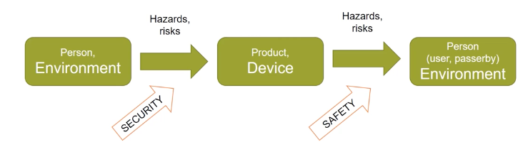

# Information Security

- **Safety, Security: Absence of unreasonable risk**

- **Security:** Protection of systems (products, devices) from external hazards. e.g Hacker manipulates ECU sofware via VLAN.

- **Safety:** Protection against hazards and risks originating from the operation of a system. (product, device) e.g ABS blocks wheels at high speed

## Security

- **Remember:**
    - **Safety is concerned with the hazards that a system may create**
    - **Security is concerned with malfunctioning of a system as a result of the activities of an attacker** 

***Techniques for detection and prevention are conceptually similar**

- Engineers need to know a lot:
    - About potential safety and security problems
    - About the system that is to be made safe and secure

## Security properties: CIA 

### Confidentiality 

- Can non-authorized parties see data ? 

### Integrity

- Has data been altered (and I should know this ? )

### Availability 
- Is data always accessible ? 

.... of data, and then of the systems that process data (including humans)

(This distinction is nice, but in practice not clear-cut)

### Non-repudiation 

- Impossibility to inappropriately deny a transaction or having sent a message

### Authenticity

- A message/action assigned to an entity was actually sent/performed by that entity

### Auditability

- Ability to recontruct (certain aspects of) earlier states of a system. 

### Accountability 

- Ability to assign responsibility for actions to an entity.

### Privacy 

- No clear definition. Refers to security of personal information. Privacy means that a person has appropriate control over which information on him or her is generated, stored, processed, deleted and by whom. 

### Anonymity
- The identity of an entity is hidden; one aspect of privacy.

## Critical infrastructures (A)

### Private data (C,I)
- Medical records
- Loyalty cards
- Mobile telephone data including location
### Commercial data (C,I)
- Digital Rights Management
- IP in distributed business processes
### Government data (C,I,A)
-  military data 
- intelligence