- [C.3 Software Architectures and their trade-offs](#c3-software-architectures-and-their-trade-offs)
  - [C 3.1 Introduction to distributed systems and middleware](#c-31-introduction-to-distributed-systems-and-middleware)
    - [Distributed Systems](#distributed-systems)
    - [Characteristics of a distributed system](#characteristics-of-a-distributed-system)
      - [Reliability](#reliability)
      - [Availability](#availability)
      - [Availability vs reliability](#availability-vs-reliability)
      - [Transparency](#transparency)
    - [Middleware](#middleware)
  - [C 3.2 Database-centric architectures](#c-32-database-centric-architectures)
    - [Shared data-space architectural style](#shared-data-space-architectural-style)
    - [The client-server evolution](#the-client-server-evolution)
    - [A typical mainframe model](#a-typical-mainframe-model)
    - [A typical three-layered client/server architecture](#a-typical-three-layered-clientserver-architecture)
    - [Views - terminology](#views---terminology)
    - [Purpose of views](#purpose-of-views)
    - [Subprograms, stored procedures, functions and packages](#subprograms-stored-procedures-functions-and-packages)
      - [Stored Procedure - example](#stored-procedure---example)
  - [C 3,2,1 Data warehousing and business intelligence](#c-321-data-warehousing-and-business-intelligence)
    - [Data analysis problems](#data-analysis-problems)
  - [Data warehouse (DW)](#data-warehouse-dw)
      - [Data as materialized views](#data-as-materialized-views)
      - [Function vs Subject Orientation](#function-vs-subject-orientation)
      - [Top-down vs bottom-up](#top-down-vs-bottom-up)
    - [Extract, Transform, Load (ETL)](#extract-transform-load-etl)
    - [Central DW Architecture](#central-dw-architecture)

# C.3 Software Architectures and their trade-offs


## C 3.1 Introduction to distributed systems and middleware 

### Distributed Systems 

- **Distributed system: Physically disjoint compute resources, interconnected by a network**

- A distributed system is one in which **hardware** or **software components** located at **networked computers communicate** and **coordinate** their actions only by **passing messages**  By Coulouriset al. 

- A distributed system is a **collection of independent computers** that appears to its users as **a single coherent system** By Tanenbaum & van Steen


- **A distributed system is one in which the failure of a computer you did not even know existed can render your own computer unusable.** [Leslie Lamport (1987)]


### Characteristics of a distributed system 

- Reliability 
- Availability 
- Heterogeneity (variety and differences in networks, hardware, operating systems, programming lanuages ...)
- Opennes (concerned with extensions)
- Security
- Scalability (accommodate more users, respond faster)
- Fault-tolerance and failure handling 
  - Hardware, software and networks may fail ...
  - Fault tolerance through recovery, redundancy ...
- Concurrency
- Transparency (access, location, concurrency, replication)
- Predictable performance

#### Reliability 

- **Probability of a system to perform its required functions under stated conditions for a specified period of time**
- To run continuously without failure (that is: correctly)
- Expressed as mean time between failures (MTBF), failure rate


#### Availability 

- **Proportion of the time a system is in a functioning state, i.e can be used**
- Ratio of time usable over entire time
  - Informally, uptime/(uptime+downtime)
  - System that **can be used** 100hrs. out of 168 hrs. has avaialability of 100/168
  - System could be up, but not usable (outage !)

- Specified as decimal or percentage
- Five nines is 0.99999 or 99.999%  available 
- Could be represented as (1 - Unavailability)


**Measure for availability (Nines/Class of 9)**

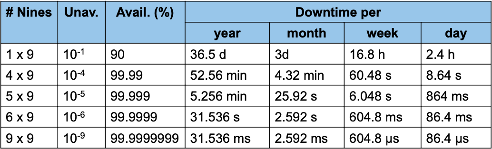

- Frequently used for telecommunication systems 
- Favorite marketing term 
- Does not capture impact or cost of downtime


#### Availability vs reliability 

**Availability is not equal to reliability**

- Reliable system has high availability but an available system may or may not be reliable. 
- Server may never be down but sometimes cause incorrect results, e.g. as a result of ill-functioning synchronization


#### Transparency 

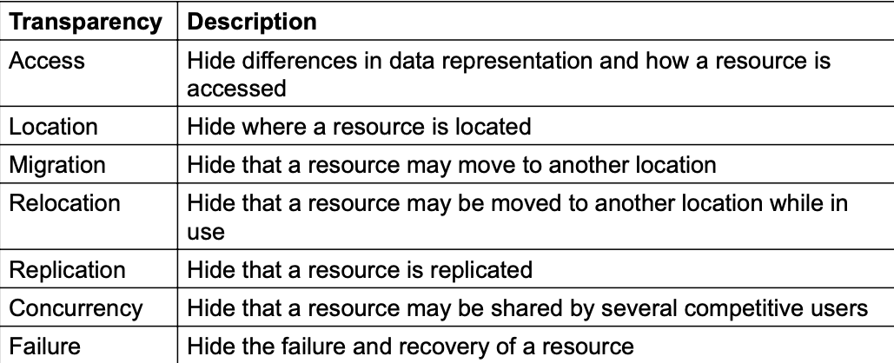

> [ISO 1995]


### Middleware 

**Middleware comprises services and abstractions that facilitate the design, development and deployment of distributed applications in heterogeneous, networked environments**

**Example abstractions:** Remote invocation, messaging, pub/sub, TP Monitor, locking service, etc.

**Examples**: DCE, CORBA, RMI, JMS, Web Services, etc

- Captures **common functionalities**
  - Message passing, remote invocation
  - Message queuing, pub/sub
  - Transaction processing 
  - Naming, directory, security provisions
  - Foult-tolerance, consistent views
  - Replication, availability

- Deals with interoperability 
- Deals with system integration

**Middleware Stack**


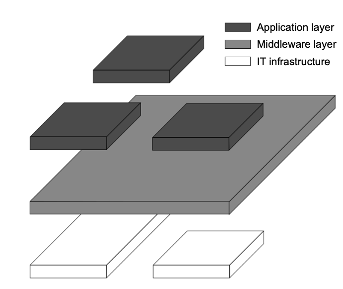

## C 3.2 Database-centric architectures 

- Main purpose: data access and update 
  - Databases play a crucial role
  
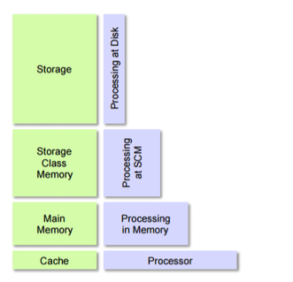

- Processes interact by reading and modifying data in some shared repository(active or passive)
  - Traditional database (passive): Responds to requests
  - Blackboard system(active): Clients solve problems collaboratively; system updates clients when information changes

- Favors stored procedures that run on database aservers, as opposed to greater reliance on logic running in middle-tier application servres in a multi-tier architecture.

### Shared data-space architectural style


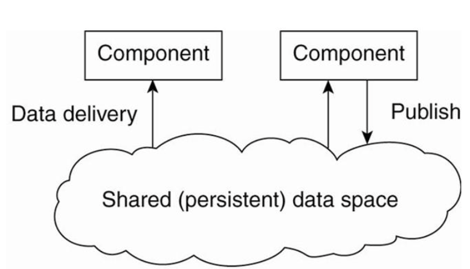


### The client-server evolution

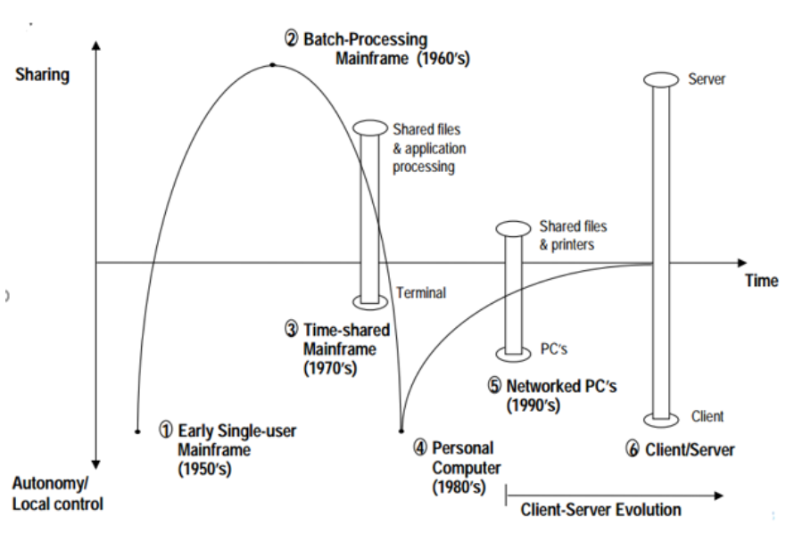

> "Evolving IT architectures: from mainframes to client-server to network computing" S. Madnick(1998)"


### A typical mainframe model


- The mainframe model uses the mainframe as a central repository for information as well as processing for every application.

- Terminals enable input/output into the applicaitons 
- All administration takes place on the mainframe itself


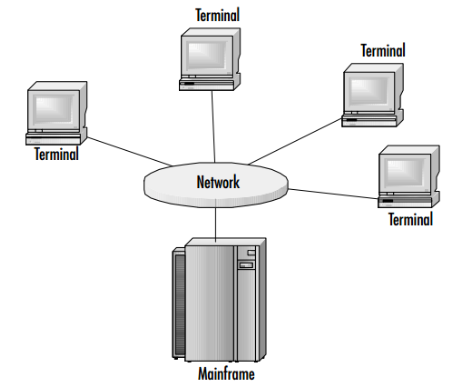


**Advantages**

- Hardware maintanence cost reduction
- Single point of administration
- One type of administrative skill set
- Simple architecture and low bandwidth requirements


**Drawbacks**

- Single point of failure 
- Character-based applications 
  - Mainframe applications are generally textual
- Bottlenecks due to time-sharing systems


### A typical three-layered client/server architecture

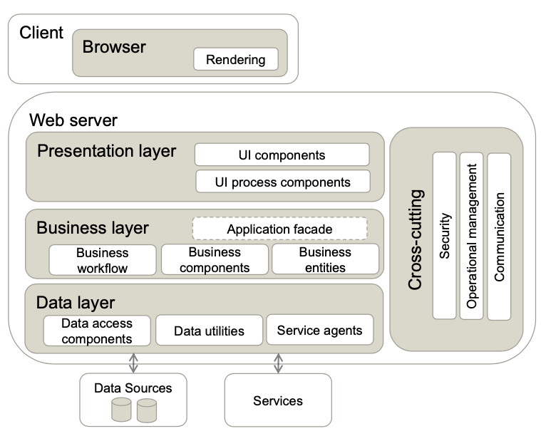

**Advantages**

- Reduced hardware costs
- No single point of failure 
- Flexibility
- Scalable architecture

**Disadvantages**

- Heightened administrative cost
- Increased security risks 
- Lack of centralized backup


### Views - terminology

**Base relation**

**A named relation corresponding to an entity in the conceptual schema whose tuples are physically stored in the database.**


**View**

- **The dynamic result of one or more relational operations operating on the base relations to produce another relation**

- **A view is a virtual relation that does not actually exist in the database but is produced upon request, at the time of request**


- Views are dynamic, i.e changes made to base relations that effect view attributes are immediately reflected in the view.

**Example**

```sql
CREATE VIEW profNumStudents AS 
SELECT pNumber, count(*) AS CNT
FROM Student
GROUP BY pNumber;
```

### Purpose of views

- Provides a powerful and flexible security mechanism by hiding parts of database from certain users
- Permits users to access data in a customized way, so that same data can be seen by different users in different ways, at same time. 
- It can simplify complex operations on base relations
- Complex queries can be reused
- Logical data independence (the base table may change but the view could remain the same)

**Advantages**
- Data independence
- Improved security
- Reduced complexity
- Convenience
- Customization
- Data Integrity
  

**Disadvantages**

- Update restriction
- Structure restriction
- Performance

### Subprograms, stored procedures, functions and packages 

- Subprograms are named PL/SQL blocks that can take parameters and can be invoked
- PL/SQL has two types of subprogram called (stored) procedures and functions
- Procedures and functions are identical except that functions always return a value (procedures do not)
- By processing the SQL code on the database server, both
  - the number of instructions sent across the network and
  -  the amount of data returned from the SQL statements are reduced
-  A package is a collection of procedures, functions, variables, and SQL statements that are grouped together and stored as a single program unit


#### Stored Procedure - example

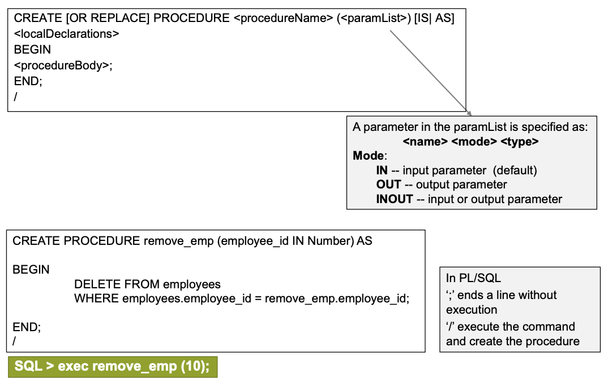


**Advantages**
- Extensibility 
- Reusability
- Maintainability
- Aid abstraction
- Improves testability
  - Can be tested independetly of the application
- Speed/optimization
  - Stored procedures are cached on the server
- Improved security

**Disadvantages**

- Limited coding functionality
  - Not as robust as app code
- Portability issues
- Reduced flexibility and agility


## C 3,2,1 Data warehousing and business intelligence


- Business intelligence
  - Extract knowledge from large amounts of collected business data
  - Combination of technologies 
    - Data warehousing 
    - On-Line Transaction Processing (OLTP)
    - Data mining

- **Data warehousing** is a collection of methods, techniques and tools which is used to support knowledge workers such as senior managers, directors, manager, and business analysts to conduct data analyses that help with performing decision-making processes and improving information resources.

### Data analysis problems

- The same data found in many different systems 
  - Example: customer data across different stores and departments 
  - The same concept is defined differently

- Heterogeneous sources
  - Relational DBMS, On-Line Transaction Processing(OLTP)
  - Unstructured data in files (e.g MS Word)
  - Legacy systems

- Data is suited for operational systems
  - Accounting, billing, etc
  - Do not support analysis across business functions
- Data quality is bad
  - Missing data, imprecise data, different use of systems

- Data is "volatile"
  - Data deleted in operational systems
  - Data change over time- no historical information
  

  ## Data warehouse (DW)

- A data warehouse is a collection of data that supports decision-making processes.

It provides the following features:

- It is subject-oriented
- It is integrated and consistent
- It shows its evolution over time and it is non-volatile

**Data from the operational systems are**
- Extracted 
- Cleansed
- Transformed
- Aggregated
- Loaded into the data warehouse

A good data warehouse is a prerequisite for successful BI 


#### Data as materialized views

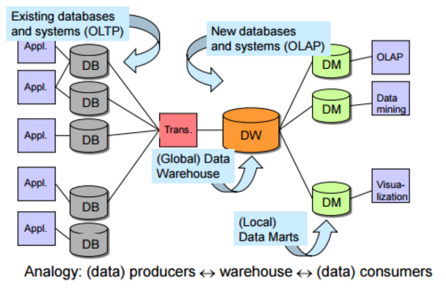

>[“Data Warehouse Design: Modern Principles and Methodologies.” Golfarelli, M., & Rizzi, S. (2009)]


#### Function vs Subject Orientation

- A datamart(DM) is a subset or an aggregation of the data stored to a primary data warehouse. It includes information relevant to a specific business area, corporate department, or category of users. 


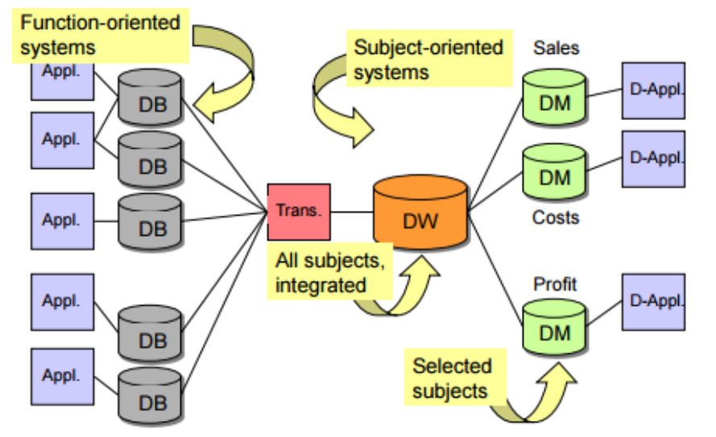

>[“Data Warehouse Design: Modern Principles and Methodologies.” Golfarelli, M., & Rizzi, S. (2009)]


#### Top-down vs bottom-up

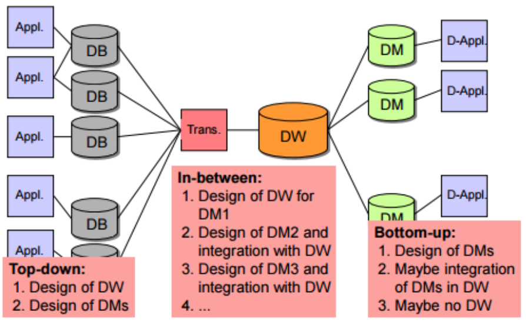

>[“Data Warehouse Design: Modern Principles and Methodologies.” Golfarelli, M., & Rizzi, S. (2009)]


### Extract, Transform, Load (ETL)

**Getting multidimensional data into the DW**

- Problems
  1. Data from different sources
  2. Data with different formats
  3. Handling of missing data and erroneous data
  4. Query performance of DW

- **ETL**
  - Extract (for problem #1)
  - Transformations/ cleansing (for problems #2, #3)
  - Load the data to DW
    - Materialized view - precompute some partial result in advance and store it (problem #4)
  - The most time-consuming process in DW development
    - 80 % of development time spent on ETL
  
### Central DW Architecture

- All data in one place, central DW
- All client queries directly on the central DW

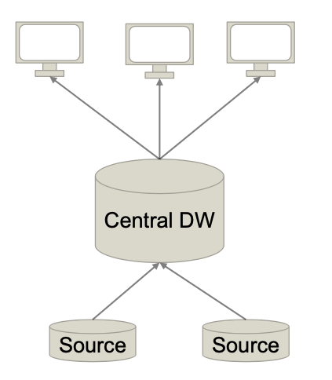

- Pros
  - Simplicity
  - Easy to manage
- Cons
- Bad performance due to lack of redundancy/workload distribution


